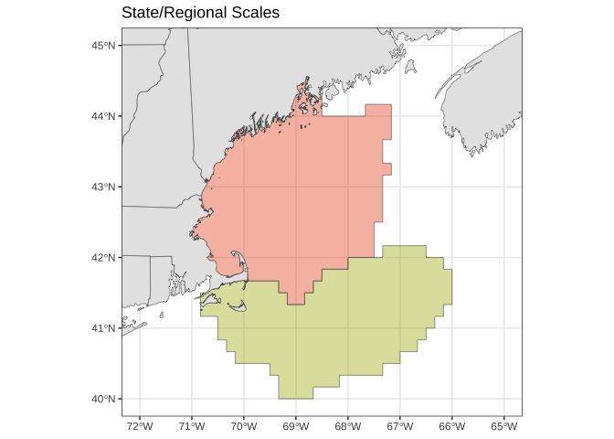

# Lobster-ECOL README

# Lobster-ECOL

This is the ecological data processing code for the Lobster ecology
project. This project’s scope ranges across spatial scales working
outward from a nearshore area that is sampled with Maine’s ventless trap
survey (3nm), to an area that is further offshore but state managed
(6nm), and ultimately to t shelf-scale area that is sampled by the
Federal Government’s fisheries independent surveys.

At each of these spatial scales physical and ecological metrics have
processed for further use in research.Code in this repository covers the
acquisition and data processing of physical and ecological datasets at
the following scales and from the following sources:

# A.) Nearshore Scale Maine + New Hampshire Metrics:

### Local Currents

1.  Maine Coastal Current, Turnoff

> Source: FVCOM

#### Sea Surface Temperature

1.  SST Anomalies
2.  Days over 20 C
3.  Days within 12-18 C

> Source: FVCOM

#### Bottom Temperature

1.  BT Anomalies
2.  Days over 20 C
3.  Days within 12-18 C

> Source: FVCOM

------------------------------------------------------------------------

# B.) State/Regional Scale: Gulf of Maine, SNE & GB Metrics:

#### Sea Surface Temperature

1.  SST Anomalies  
2.  Days over 20 C
3.  Days within 12-18 C

> Source: FVCOM

#### Bottom Temperature

1.  BT Anomalies
2.  Days over 20 C
3.  Days within 12-18 C

> Source: FVCOM

#### Primary Productivity

1.  Annual PAR and photosynthetic efficiency

> Source: Ecodata

#### Zooplankton

1.  Annual abundance by taxa

> Source: Ecodata

#### Lobster Predator Indices

1.  Predator abundance
2.  Predator size spectra

> Sources: NEFSC & ME/NH Survey

#### Predator exploitation rate

1.  Based on rate as calculated in the 2020 lobster stock assessment as
    the annual catch of lobster divided by the estimate of population
    abundance

> Source: ASMFC 2020 lobster stock assesment

------------------------------------------------------------------------

# C.) Northeast US Shelf-wide Scale:

#### Gulf Stream Position

> Source: Ecodata

#### Sea Surface Temperature

1.  SST Anomalies
2.  Days over 20 C
3.  Days within 12-18 C

> Source: FVCOM

#### Bottom Temperature

1.  BT Anomalies
2.  Days over 20 C
3.  Days within 12-18 C

> Source: FVCOM

#### Salinity

> Only if requested Source: FVCOM

#### Currents

1.  Relative inflow of GS vs. Scotian Shelf water at NE Channel

> Source: ecodata::slopewater

# Lobster-ECOL Quarto Docs Directory

[Area Subsetting in R with
{FVCOM}](https://adamkemberling.github.io/Lobster-ECOL/R/FVCOM_prep/FVCOM_Area_Subsetting_Demo.html)

[Exploring Monthly File Contents and
Structures](https://adamkemberling.github.io/Lobster-ECOL/R/FVCOM_prep/FVCOM_GMRI-Monthly-Inventory-Check.html)

[Maine Coastal Current
Processing](https://adamkemberling.github.io/Lobster-ECOL/R/FVCOM_prep/FVCOM_MaineCoastalCurrent.html)
