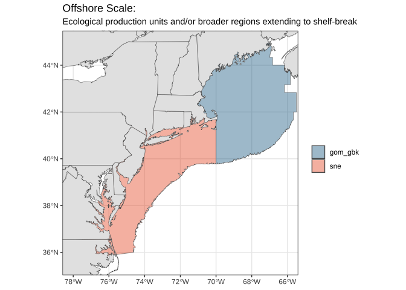
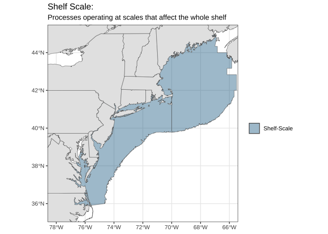

# Lobster-ECOL README

# Lobster-ECOL

This is the ecological data processing code for the Lobster ecology
project. This project’s scope ranges across spatial scales working
outward from a nearshore area that is sampled with Maine’s ventless trap
survey (3nm), to an area that is further offshore but state managed
(6nm), and ultimately to the shelf-scale area that is sampled by the
Federal Government’s fisheries independent surveys.

At each of these spatial scales physical and ecological metrics have
processed for further use in research. Code in this repository covers
the acquisition and data processing of physical and ecological datasets
at the following scales and from the following sources:

| Area | Metric | Frequency | Data Source |
|:---|:---|:---|:---|
| Nearshore | Sea Surface Temperature | Daily | FVCOM |
| Nearshore | Sea Bottom Temperature | Daily | FVCOM |
| Nearshore | Sea Surface Salinity | Daily | FVCOM |
| Nearshore | Sea Bottom Salinity | Daily | FVCOM |
| Nearshore | Maine Coastal Current Continuity | Daily | FVCOM |
| Nearshore | Days within 12-18C | Daily | FVCOM |
| Nearshore | Days over 20C | Daily | FVCOM |
| Offshore | Sea Surface Temperature | Daily | FVCOM |
| Offshore | Sea Bottom Temperature | Daily | FVCOM |
| Offshore | Sea Surface Salinity | Daily | FVCOM |
| Offshore | Sea Bottom Salinity | Daily | FVCOM |
| Offshore | Days within 12-18C | Daily | FVCOM |
| Offshore | Days over 20C | Daily | FVCOM |
| Offshore | Primary Productivity (ppd, ppd ratio) | Seasonal | ecodata::chl_pp |
| Offshore | Primary Productivity (Chl-A) | Seasonal | ecodata::chl_pp |
| Offshore | Zooplankton Community Index | Annual | ecodata::zoo_abundance_anom |
| Offshore | Lobster Predator Abundance | Seasonal | Trawl Surveys |
| Offshore | Lobster Predator Size Spectra | Seasonal | Trawl Surveys |
| Shelf-Scale | Gulf Stream Position Index | Annual/Monthly | ecodata::gsi |
| Shelf-Scale | Northeast Channel Water Mass | Annual | ecodata::slopewater |

# A.) Nearshore Scale

Figure 1

------------------------------------------------------------------------

# B.) Offshore & Regional Scale

1.  Gulf of Maine & Georges Bank
2.  Southern New England

Figure 2

------------------------------------------------------------------------

# C.) Northeast US Shelf-wide Scale

# Lobster-ECOL Quarto Docs Directory

[Area Subsetting in R with
{FVCOM}](https://adamkemberling.github.io/Lobster-ECOL/R/FVCOM_prep/fvcom_general_methods/FVCOM_Area_Subsetting_Demo.html)

[Exploring Monthly File Contents and
Structures](https://adamkemberling.github.io/Lobster-ECOL/R/FVCOM_prep/gmri_inventory_exploration/FVCOM-GMRI-Monthly-Inventory-Check.html)

[Interpolating Point
Values](https://adamkemberling.github.io/Lobster-ECOL/R/FVCOM_prep/Survey_Locations_FVCOMTemp_Interpolation.html)

[Timeseries for Areas of
Interest](https://adamkemberling.github.io/Lobster-ECOL/R/FVCOM_prep/FVCOM_Regional_Temperature_Timeseries.html)

[Maine Coastal Current
Processing](https://adamkemberling.github.io/Lobster-ECOL/R/FVCOM_prep/FVCOM_MaineCoastalCurrent_PCA.html)

[FVCOM Temperature Regime Shifts with
STARS](https://adamkemberling.github.io/Lobster-ECOL/R/regime_tests/STARS_FVCOM.html)
